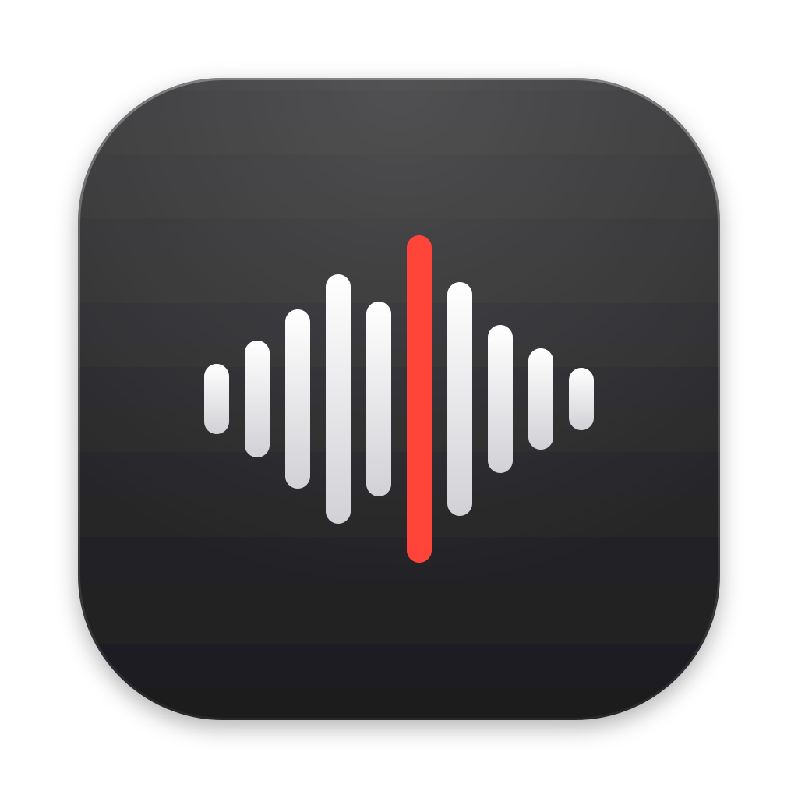

<p align="center"></p>

# DrDoctor

A native macOS app that checks the mastering of your music files: dynamic range, loudness, clipping, spectrum and stereo image, with a plain verdict per track and per album. Built with SwiftUI and Accelerate, no external dependencies.

## Features

- **DR14 dynamic range** following the Pleasurize Music Foundation spec, as used by foobar2000's DR Meter and the DR Database: whole track, every channel, 3-second blocks, top 20% RMS, second-highest peak. Matches ffmpeg's `drmeter` on the same PCM.
- **Loudness**: approximate integrated loudness (LUFS) and loudness range.
- **Clipping and true peak**: clipped-sample detection and 4× oversampled true peak (dBTP).
- **Spectral analysis**: FFT average spectrum with cutoff detection to flag **fake lossless** files (lossy sources transcoded to FLAC/WAV).
- **Stereo image**: L/R correlation, Mid/Side width, per-band width, phase issues and a vectorscope.
- **Album analysis**: analyze a whole folder (3 tracks at a time) and get a sortable table with album averages.
- **A/B comparison**: compare two editions of the same album (remaster vs. original, CD vs. SACD) track by track.
- **Native DSD**: reads DSF files directly and converts DSD to PCM with Accelerate (vDSP), fast enough for whole albums.

Supported formats: DSF, FLAC, WAV, AIFF, ALAC/M4A, MP3, AAC.

The iOS version, Dr. Doctor, is available on the App Store and gives identical results.

## Install

With [Homebrew](https://brew.sh):

```bash
brew install --cask prietus/drdoctor/drdoctor
```

Or download the signed and notarized DMG from [Releases](https://github.com/prietus/drdoctor/releases) and drag DrDoctor to Applications.

Requires macOS 14 Sonoma or later.

## Build from source

Open `DrDoctor.xcodeproj` in Xcode and run the `DrDoctor` scheme, or:

```bash
xcodebuild -project DrDoctor.xcodeproj -scheme DrDoctor -configuration Release build
```

Build in Release when measuring performance: the DSD decoder and analyzers are much slower without optimization.

## How the verdict works

Each track gets a score from its DR value, loudness, clipping and spectral checks:

| Verdict | Meaning |
|---|---|
| Excellent Mastering | High dynamic range, no clipping |
| Good Mastering | Reasonable dynamics |
| Mediocre Mastering | Noticeably compressed |
| Poor Mastering (Loudness War) | Heavily compressed or clipped |
| Suspicious (Possible Fake Lossless) | Spectral cutoff typical of a lossy source |

Lossy-source detection is skipped for DSD, because the DSD-to-PCM low-pass filter produces a sharp cutoff by design.

## License

[MIT](LICENSE)
